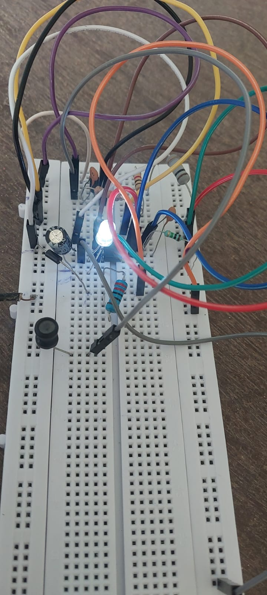

# 📱 Mobile Incoming Call Indicator

> **Team Project | Network Theory Laboratory | NIT Agartala**

A compact electronic hardware system designed to detect RF activity from a nearby mobile phone and provide a **visual indication through an LED**.

The project combines **RF signal detection, transistor switching, NE555 timer operation, analog circuit design, and hardware prototyping**.

---

## 📸 Hardware Prototype

<p align="center">
  
</p>

The circuit was assembled and tested on a breadboard using discrete electronic components, an NPN transistor, pickup coil, NE555 timer IC, LED, and supporting passive components.

---

## 🎯 Objective

The objective of this project is to build a small electronic circuit capable of detecting RF activity generated by a nearby mobile phone and converting the detected signal into a visible output.

The system is intended to provide an indication even when the mobile phone's ringer is switched off or kept in silent mode.

---

## 🧠 System Overview

The complete system can be represented as:

```text
        Mobile Phone
             │
             │ RF Activity
             ▼
       ┌─────────────┐
       │ Pickup Coil │
       └──────┬──────┘
              │
              ▼
      ┌─────────────────┐
      │ Signal Detection│
      │ & Conditioning  │
      └────────┬────────┘
               │
               ▼
       ┌──────────────┐
       │ NPN Transistor│
       │    Stage      │
       └──────┬───────┘
              │
              ▼
       ┌──────────────┐
       │   NE555 Timer │
       └──────┬───────┘
              │
              ▼
          ┌───────┐
          │  LED  │
          └───────┘
              │
              ▼
      Visual Indication
```

### Block Diagram

<p align="center">
  
</p>

---

## ⚙️ Working Principle

### 1. RF Signal Detection

When a mobile phone becomes active during communication, it produces electromagnetic/RF activity.

A pickup coil placed near the mobile phone detects the induced signal.

### 2. Signal Coupling

The detected signal from the pickup coil is coupled into the transistor stage.

The transistor responds to the detected signal and acts as the switching/amplification stage of the detector.

### 3. NE555 Timer Stage

The processed signal is applied to the trigger section of the **NE555 timer IC**.

The timer generates the output required to activate the indicator.

### 4. LED Indication

The output of the NE555 drives the LED, providing a visible indication when the circuit detects the required RF activity.

---

## 🔌 Circuit Diagram

<p align="center">
  
</p>

The circuit consists of:

- RF pickup coil
- Transistor detection/switching stage
- NE555 timer
- Timing and filtering components
- LED indicator
- Power supply

---

## 🔧 Main Components

| Component | Role |
|---|---|
| **NE555 Timer IC** | Timer/output generation |
| **BC548 NPN Transistor** | Signal switching/amplification |
| **Pickup Coil / Inductor** | RF signal pickup |
| **LED** | Visual indication |
| **Resistors** | Biasing and timing |
| **Capacitors** | Timing/filtering |
| **1N5819 Diode** | Protection/rectification stage |
| **6V Supply** | Circuit power |

### Components visible in the circuit design

- R1 — 100 kΩ
- R2 — 3.9 kΩ
- R3 — 1 MΩ
- C1 — 100 nF
- C2 — 220 µF
- BC548 NPN transistor
- NE555 timer IC
- 1N5819 diode
- LED
- Pickup coil
- 6V supply

> Component values above are taken from the project circuit diagram. Verify values against the physical prototype before using them for reproduction.

---

## 🛠️ Technical Concepts Demonstrated

- Analog electronics
- RF signal detection
- Electromagnetic induction
- Transistor switching
- NE555 timer circuits
- Signal conditioning
- Electronic circuit design
- Breadboard prototyping
- Hardware testing
- Hardware troubleshooting
- Component-level analysis

---

## 🧪 Hardware Testing

The prototype was assembled on a breadboard and tested by placing a mobile phone near the detector.

During RF activity, the detected signal is processed through the transistor and NE555 stages, resulting in activation of the LED indicator.

### Prototype

<p align="center">
  
</p>

---

## 📊 System Flow

```text
RF Activity
    │
    ▼
Pickup Coil
    │
    ▼
Signal Detection
    │
    ▼
BC548 Transistor
    │
    ▼
NE555 Timer
    │
    ▼
LED
    │
    ▼
Visual Indication
```

---

## 💡 Engineering Challenges

During development, the important hardware considerations included:

- Detecting a relatively weak RF signal
- Properly coupling the pickup coil to the detection stage
- Obtaining reliable transistor switching
- Correctly configuring the NE555 timer
- Selecting appropriate resistor and capacitor values
- Ensuring proper power and ground connections
- Testing the circuit on a breadboard
- Troubleshooting connections and component behavior

---

## 🚀 Future Improvements

Possible improvements to the system include:

- Improve RF detection sensitivity
- Increase detection range
- Reduce false triggering
- Optimize the pickup coil design
- Improve power efficiency
- Design a compact PCB version
- Add an audible indication
- Perform systematic sensitivity and reliability testing
- Optimize the circuit for a smaller enclosure

---

## 👨‍💻 My Contribution

This was developed as a **team project** as part of the Network Theory Laboratory at NIT Agartala.

My contribution included:

- Understanding the overall circuit architecture and working principle
- Working with the circuit assembly and component connections
- Studying the RF detection and transistor switching stages
- Participating in hardware testing and troubleshooting
- Analyzing the NE555 timer and LED indication stage

> **Note:** Contribution points should be adjusted to accurately reflect the work personally performed by me.

---

## 👥 Team

**Department:** Electronics & Instrumentation Engineering  
**Institute:** National Institute of Technology, Agartala  
**Laboratory:** Network Theory Laboratory

### Team Members

- Dhirendra Sahani
- Anuradha Kumari
- Abhishek Kumar
- Anjali Patel
- Saumya Shreya
- Aman Kumar

---

## 📂 Repository Structure

```text
mobile-incoming-call-indicator/
│
├── README.md
│
├── circuit/
│   └── schematic.png
│
├── images/
│   ├── block-diagram.png
│   ├── circuit-diagram.png
│   └── hardware.jpeg
│
└── documentation/
    └── project-report.pdf
```

---

## 🎓 Skills Demonstrated

**Electronics | Analog Circuits | RF Detection | NE555 | Transistor Circuits | Circuit Design | Hardware Prototyping | Testing | Troubleshooting**

---

## 📄 Project Documentation

The complete project report is available in the `documentation/` folder.

---

## ⭐ Project Highlights

- Designed and prototyped an RF-based mobile activity detection circuit
- Integrated a pickup coil, transistor stage and NE555 timer
- Built and tested the circuit on a breadboard
- Implemented LED-based visual indication
- Applied analog electronics and signal-detection concepts in a practical hardware system

---

**Developed as part of the Electronics & Instrumentation Engineering curriculum at NIT Agartala.**