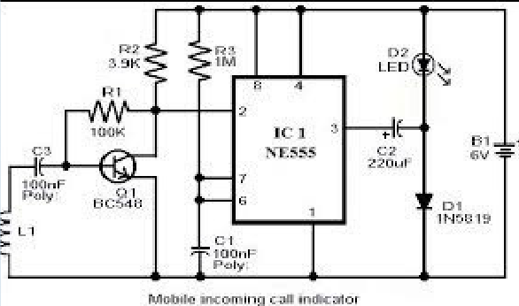
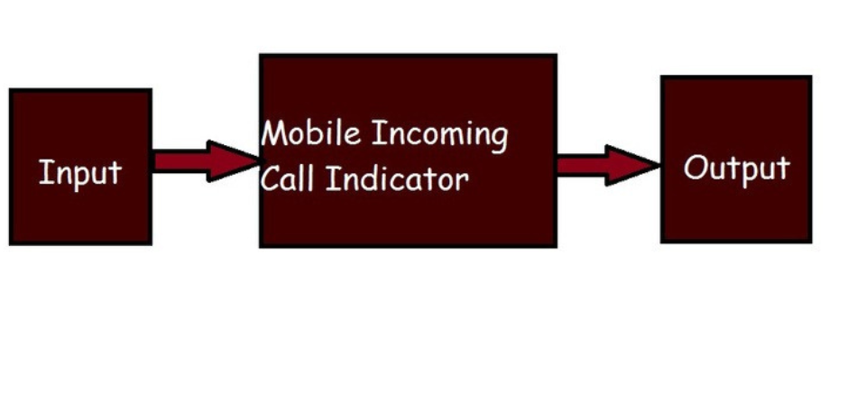

# 📱 Mobile Incoming Call Indicator

An electronic hardware project designed to detect RF activity from a nearby mobile phone and provide a **visual indication using an LED**, even when the phone is in silent mode.

---

## 📌 Project Overview

The **Mobile Incoming Call Indicator** is a compact electronic circuit developed to detect RF signals emitted by a mobile phone during communication activity.

The system uses a **pickup coil/inductor** to detect RF activity. The detected signal is processed through a transistor stage and used to trigger an **NE555 timer**, which drives an LED to provide a visual indication.

The project demonstrates concepts from **analog electronics, RF signal detection, transistor switching, timer circuits, and hardware prototyping**.

---

## ⚙️ Working Principle

The system works through the following stages:

```text
Mobile Phone RF Activity
          ↓
      Pickup Coil
          ↓
    Signal Detection
          ↓
   Transistor Stage
          ↓
     NE555 Timer
          ↓
         LED
          ↓
 Visual Indication
```

### 1. RF Signal Detection

When a mobile phone becomes active during communication, it emits RF signals. The pickup coil placed near the phone detects these electromagnetic signals.

### 2. Signal Detection and Processing

The weak signal detected by the coil is coupled to the transistor stage. The transistor responds to the detected signal and acts as a switching/amplification stage.

### 3. NE555 Timer

The processed signal triggers the **NE555 timer**, which generates the required output signal for the indicator.

### 4. LED Indication

The output of the timer drives an LED. When RF activity is detected, the LED provides a visual indication.

The project documentation describes the complete detection process, including RF pickup, signal processing, transistor switching and indicator activation.

---

## 🔧 Hardware Components

| Component | Purpose |
|---|---|
| NE555 Timer IC | Timer and output generation |
| Pickup Coil / Inductor | RF signal detection |
| NPN Transistor | Signal switching/amplification |
| Resistors | Biasing and circuit operation |
| Capacitors | Filtering and timing |
| LED | Visual indication |
| Power Supply | Circuit power |

The project report lists the NE555 timer, resistors, capacitors, NPN transistor and inductor among the hardware components.

---

## 🧩 Circuit Diagram



The circuit consists of the RF pickup section, transistor stage, NE555 timer section and LED indicator.

---

## 📐 Block Diagram



```text
Input RF Activity
       ↓
Mobile Incoming Call Detector
       ↓
LED / Visual Output
```

---

## 🛠️ Technical Concepts Demonstrated

- Analog electronics
- RF signal detection
- Electromagnetic induction
- Signal conditioning
- Transistor switching
- NE555 timer
- Electronic circuit design
- Hardware prototyping
- Circuit testing
- Hardware troubleshooting
- LED-based indication

---

## 🧪 Testing

The circuit was tested by placing a mobile phone near the detector and observing the LED response when the phone generated RF activity.

The project documentation reports detection of an activated mobile phone from approximately **1.5 metres**.

> **Note:** The reported detection range should be treated as a project result rather than a guaranteed specification, since detection distance can depend on the mobile device, signal conditions, coil positioning and circuit sensitivity.

---

## 🔍 Key Engineering Learning

Through this project, I gained practical understanding of:

- Designing and assembling an electronic circuit
- Understanding RF signal detection using inductive pickup
- Working with transistor switching stages
- Understanding NE555 timer operation
- Connecting multiple circuit stages into a complete system
- Testing and troubleshooting hardware
- Understanding the relationship between circuit components and system-level output

---

## 🚀 Future Improvements

Potential improvements include:

- Improving RF detection sensitivity
- Increasing detection range
- Reducing false triggering
- Optimizing the pickup coil
- Improving circuit power efficiency
- Designing a compact PCB
- Adding an audible alert
- Performing systematic sensitivity and reliability testing

The project report identifies the pickup coil and signal amplification/555-timer stages as key parts of the system.

---

## 📂 Repository Structure

```text
mobile-incoming-call-indicator/
│
├── README.md
│
├── images/
│   ├── circuit-diagram.png
│   ├── block-diagram.png
│   ├── hardware.jpg
│   └── testing.jpg
│
├── circuit/
│   └── schematic.png
│
└── documentation/
    └── project-report.pdf
```

---

## 👥 Project Team

This project was developed as part of the **Network Theory Laboratory, Department of Electronics and Instrumentation Engineering, NIT Agartala**.

### Team Members

- Dhirendra Sahani
- Anuradha Kumari
- Abhishek Kumar
- Anjali Patel
- Saumya Shreya
- Aman Kumar

The original project report identifies the project as a Network Theory Laboratory project at NIT Agartala.

---

## 📚 Documentation

The complete project report is available in the `documentation/` directory.

---

## ⭐ Skills Demonstrated

**Electronics | Analog Circuits | RF Detection | NE555 | Transistor Circuits | Hardware Prototyping | Circuit Testing | Troubleshooting**

---

## 👨‍💻 Author

**Dhirendra Sahani**  
Electronics & Instrumentation Engineering  
National Institute of Technology, Agartala